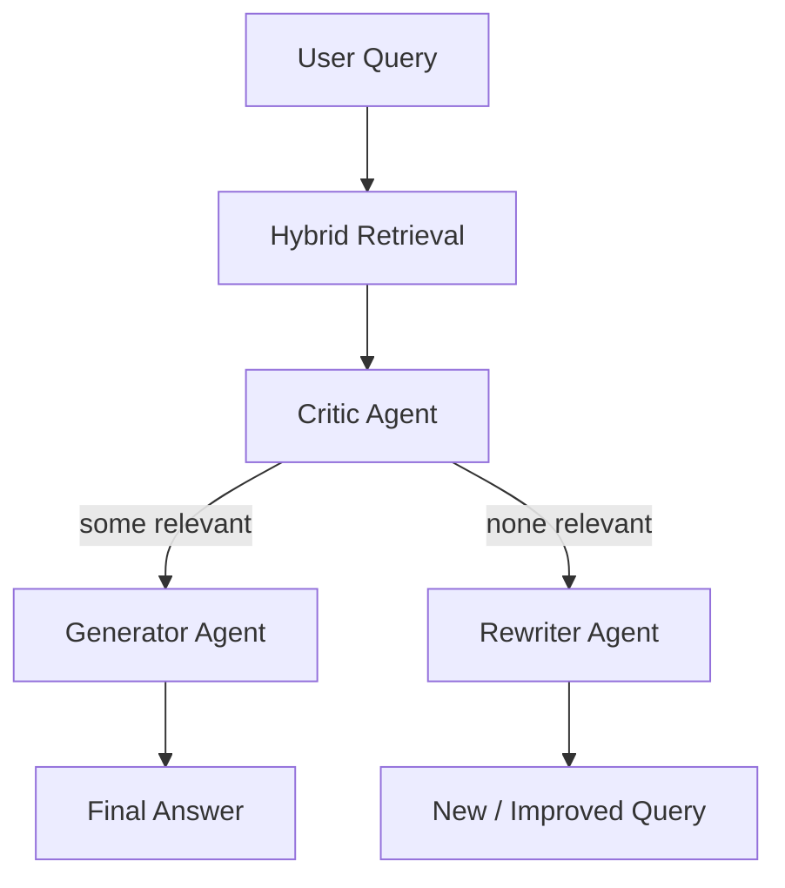

 # Agentic Corrective RAG (CRAG) — Interview Master Document (Beginner-Friendly)

**Author:** Tanishaa Tak

**Contact & Profiles:**
- LinkedIn: https://www.linkedin.com/in/tanishaatak/
- GitHub: https://github.com/taktanishatak-cmyk

 **Purpose:**
 A complete, beginner-friendly study guide for the Agentic Corrective RAG (CRAG) project in this repository. This document explains the problem, the CRAG idea, why certain technologies were chosen, how the code works (line-by-line), how to run it locally, and what to say in interviews. It focuses on practical, hands-on understanding rather than abstract theory.

 **Length & Format:**
 This Markdown is designed to be converted to a `.docx` study guide. It contains clear explanations, diagrams, runnable commands, and a detailed code walkthrough.

 **Table of Contents**
 - Quick Summary
 - What problem does CRAG solve? (plain language)
 - Overall system idea (short)
 - Architecture & Flow (diagram + explanation)
 - Tech stack (and simple reasons why)
 - How the code is organized (file map)
 - Step-by-step run instructions (copy-paste)
 - Expanded, beginner-friendly explanations for core concepts
 - Full file-by-file, line-by-line walkthrough
 - Glossary of terms
 - Interview prep tips and sample answers


## Quick Summary (1 paragraph)
CRAG improves standard Retrieval-Augmented Generation (RAG) by adding an agentic "Critic" step between retrieval and generation. The Critic checks whether retrieved documents actually answer the user's question. If they do, the Generator produces an answer; if not, a Rewriter rewrites the query and retrieval is attempted again. This prevents the LLM from confidently answering with irrelevant or hallucinated information.


## What problem does CRAG solve? (Plain language)
- Problem: LLMs can sound confident even when wrong. If the retrieval system returns wrong documents, the LLM uses them and invents an answer.
- CRAG Goal: Prevent the model from inventing info when evidence is missing or off-topic. Instead, either (a) refuse to answer or (b) fix the search query and try again.


## Overall system idea (short)
- User asks a question.
- Hybrid retrieval (semantic + keyword) returns candidate documents.
- Critic inspects documents and marks them relevant/irrelevant.
- If relevant documents exist, Generator answers using those docs.
- If not, Rewriter generates a clearer search query so the system can retrieve again.


## Architecture & Flow (diagram + explanation)

ASCII sketch:

```
[User Query] -> [Hybrid Retrieval] -> [Critic Agent]
                        |--(relevant)--> [Generator] -> [Answer]
                        |--(irrelevant)--> [Rewriter] -> [New Query]
```

Mermaid diagram (for the docx this will render as a static image if supported):



Explanation (one step at a time):
- Hybrid Retrieval: runs two kinds of searches (semantic and exact keyword) and combines results.
- Critic Agent: asks an LLM to read each retrieved document and answer "Is this relevant?" but forces the LLM to return strict JSON so code can read it safely.
- Generator: when Critic approves context, Generator forms a question+context prompt and asks an LLM to answer.
- Rewriter: when Critic rejects all docs, the Rewriter asks an LLM to rewrite the user question into a clearer search query.


## Tech stack (and simple reasons why)
- Python: common, simple for orchestration.
- Qdrant (`qdrant_client`): local vector DB with named vectors and hybrid search.
- fastembed: local ONNX embeddings (dense + sparse) — works on Apple Silicon, no PyTorch install.
- litellm: unified completion interface to LLM providers; code uses `ollama/llama3.2` as a local LLM.
- langgraph: small workflow/state graph for orchestrating agents.

Why these over others? Short bullets:
- Qdrant vs Pinecone: Qdrant is open-source, runs locally easily, and supports dual vectors.
- local embeddings vs OpenAI: eliminates API cost, adds reproducibility and privacy for interview demos.


## How the code is organized (file map)
- `main.py` — runner script to demonstrate two sample queries.
- `retrieval.py` — Qdrant client, embedding models, indexing and querying logic.
- `graph.py` — agent implementations (Critic, Generator, Rewriter) and workflow wiring.
- `docs/CRAG_Interview_Master_Document.md` — this file.


## Step-by-step run instructions (copy-paste)
These commands assume you have Python 3.10+ and Docker (for Qdrant) installed.

```bash
# 1) Start Qdrant (local):
docker run -p 6333:6333 qdrant/qdrant

# 2) (Optional) Index the sample documents:
python -c "from retrieval import init_and_index; init_and_index()"

# 3) Run the demo (2 sample queries):
python main.py
```

Notes:
- If you don't have Docker, Qdrant provides other installation options. The code assumes Qdrant is at `http://localhost:6333`.
- `fastembed` models expect ONNX runtime; on Mac M1/M2/M4 this is often straightforward.


## Expanded, beginner-friendly explanations for core concepts

1) What is semantic (dense) vs sparse search?
- Dense vectors: numerical arrays representing the meaning of a sentence (two sentences about the same idea get similar vectors).
- Sparse vectors/BM25: count-based signals that reward exact token matches (good for exact IDs, names, or acronyms).
- Hybrid search: combine both to cover broad paraphrases and exact matches.

2) What is Reciprocal Rank Fusion (RRF)?
- RRF is a way to combine ranked lists from different search methods. Each document's fused score is a sum of terms like 1 / (k + rank) where `k` is a small constant.
- Why use it? It is simple, stable, and avoids manual weight tuning.

3) Why force the Critic to return JSON?
- LLMs can return varied natural language. The code needs deterministic, machine-readable answers. By asking for strict JSON and using `response_format` in `litellm`, the Critic becomes a reliable microservice.


## Full file-by-file, line-by-line walkthrough (practical)
Below are beginner-friendly step explanations for the main files. Read them slowly; imagine you're explaining each line to someone new to code.

### `main.py` (what it does, line-by-line)
Open the file `main.py`.

- Top imports:
  - `from retrieval import search_documents` — this brings in the function that runs hybrid search against Qdrant.
  - `from graph import app` — `app` is the compiled workflow that runs Critic, then routes to generate or rewrite.

- `def run_agentic_rag(query: str):`
  - `print` lines: only for human-readable output when running the demo.
  - `raw_docs = search_documents(query, limit=2)`: runs retrieval. `limit=2` means we only care about the top 2 results.
  - `formatted_docs = [...]`: extracts `text` and `category` from each search result so the graph gets a simple, serializable structure.
  - `initial_state = {"question": query, "documents": formatted_docs, "generation": ""}`: builds the state the workflow expects.
  - `final_state = app.invoke(initial_state)`: runs the workflow synchronously and returns the final state.
  - Final print: if `generation` exists print it; otherwise show fallback (new query returned by rewriter).

- The `if __name__ == "__main__":` block simply calls `run_agentic_rag` twice to show both behavior paths.

Tip: `app.invoke` runs your agents in the order and with the routing rules defined in `graph.py`.


### `retrieval.py` (what it does, line-by-line — practical)
Open `retrieval.py`.

- Top: Qdrant client and fastembed models are initialized.
  - `client = QdrantClient(url="http://localhost:6333")`: connects to Qdrant.
  - `dense_model = TextEmbedding(model_name="BAAI/bge-small-en-v1.5")`: local dense embedder.
  - `sparse_model = SparseTextEmbedding(model_name="Qdrant/bm25")`: local sparse embedder.

- `DOCUMENTS`: a small list of example documents used for demonstration and testing.

- `init_and_index()`:
  - Deletes collection if it exists (keeps demo idempotent).
  - Creates collection with two named vectors: `text-dense` and `text-sparse`.
  - Generates embeddings for texts with both models.
  - Builds `PointStruct` items with both vectors and a simple payload containing text and category.
  - Upserts them into Qdrant.

- `search_documents(query_text: str, limit: int = 2)`:
  - Calls `dense_model.query_embed()` and `sparse_model.query_embed()` to get representations of the query.
  - Uses Qdrant's `prefetch` to run both searches and then a `FusionQuery` with `Fusion.RRF` to combine results.
  - Prints and returns the top hits.

Practical note: If you run `init_and_index()` once and then run `search_documents`, you'll see the sample documents returned for matching queries.


### `graph.py` (what it does, line-by-line — practical)
Open the file `graph.py`.

- `GraphState`: a `TypedDict` describing the state passed between agents. It contains:
  - `question` (string)
  - `documents` (list of dicts with `text` and `category`)
  - `generation` (string where the Generator writes its output)

- `grade_documents(state)` (the Critic):
  - It builds a `system_prompt` that forces the LLM to answer with a JSON `{"score": "yes"}` or `{"score": "no"}`.
  - For each document, it calls `completion(...)` with `response_format={"type": "json_object"}` so the library returns machine-parsable JSON.
  - If the parsed score is `yes`, the document is kept; otherwise filtered out.

- `generate(state)` (the Generator):
  - Concatenates the filtered documents into a `context` string.
  - Calls `completion` to ask the model to answer concisely using the context.
  - Returns `{"generation": answer}`.

- `transform_query(state)` (the Rewriter):
  - Calls `completion` with a strict system prompt: "Output ONLY the optimized search query." This avoids the model including extra commentary.
  - Returns `{"question": better_question}` which the main script can use to re-run retrieval.

- Routing: `decide_to_generate(state)` returns either the `generate` or `transform_query` node name depending on whether `state['documents']` is empty.

- The `StateGraph` nodes and edges are added and the workflow compiled to `app`.


## Glossary (short)
- RAG: Retrieval-Augmented Generation — a system that retrieves documents and gives them to an LLM for answering.
- LLM: Large Language Model.
- Dense vector: numeric embedding capturing meaning.
- Sparse vector: token-based vector (like BM25) capturing exact matches.
- RRF: Reciprocal Rank Fusion, a rank-combining technique.


## Interview prep tips and sample answers (practical)
- "If the Critic filters out a relevant doc by mistake, what then?"
  - You can add thresholds, multiple Critics (ensemble), or human-in-the-loop review. Also log every filtered doc to measure false-negative rates and adjust prompts.

- "How would you scale this?"
  - Cache embeddings, batch Critic LLM calls, run Critic with a smaller specialized model, or pre-train a classifier for speed.

- "How to measure success?"
  - Metrics: accuracy of final answers (human eval), hallucination rate (human or reference-based), retrieval precision@k, and Critic false negative/positive rates.


---

Document updated for beginner clarity and saved to `docs/CRAG_Interview_Master_Document.md`.

Next: convert this Markdown to a `.docx` in the workspace.

## Recent Repository Changes (what I added and why)

- Added a beginner-friendly expansion and many practical examples to this document so interviewers and beginners can read it easily.
- Added `tools/convert_md_to_docx.py` — a small script that converts this Markdown into a `.docx` file for easy sharing.
- Generated `docs/CRAG_Interview_Master_Document.docx` from the Markdown so you can open the guide in Word/Pages and present it.

Why these changes matter:
- Many interviewers or collaborators prefer a Word document. The `.docx` makes sharing simple.
- The added beginner explanations and stories make it easier to explain the system aloud during an interview.


## Story-Based Examples (readable answers you can tell in interviews)

Story 1 — On-topic question (happy path):

- Scenario: Your teammate asks: "How many missed heartbeats trigger our PostgreSQL failover?"
- What happens behind the scenes:
  1. The system runs hybrid retrieval and finds a document that says: "The failover triggers after 3 missed heartbeats." (dense and sparse search both surface the infrastructure doc).
  2. The Critic reads the retrieved document(s) and returns `yes` because the doc contains the answer.
  3. The Generator receives the vetted context and answers: "The failover triggers after 3 missed heartbeats." (concise and grounded).

- How to explain this in an interview (one-liner story):
  "A user asked about failover; we fetched docs, our Critic checked the docs for relevance, and because the doc explicitly stated '3 missed heartbeats', our Generator returned that exact answer — no hallucination because the evidence was verified."


Story 2 — Off-topic question (recovery path):

- Scenario: A user asks: "What's our policy on bringing pets to the office?"
- What happens:
  1. Hybrid retrieval accidentally returns technical docs about PostgreSQL (because of a superficial keyword match).
  2. The Critic inspects the retrieved docs and returns `no` for all of them (they don't answer the pet question).
  3. The workflow routes to the Rewriter Agent, which rewrites the user query into a better search query like "office pet policy employees".
  4. In a full system we'd re-run retrieval with the new query and repeat the Critic step until we find relevant HR docs.

- Interview story to tell:
  "When a user asked about pets and retrieval returned tech docs, our Critic refused to let the LLM answer. We asked a Rewriter to produce a clearer search term and would run retrieval again — preventing the model from inventing a policy it didn't have evidence for."


## Simple Q&A lines & short scripts you can memorize

- Q: "Why add a Critic?"
  - Script: "Because LLMs can be confidently wrong. The Critic acts like a fact-checker: it reads retrieved docs and only lets the generator answer if the docs are relevant."

- Q: "How does hybrid search help?"
  - Script: "Dense search finds meaning and paraphrases; sparse matches exact tokens. Combining both ensures we find both paraphrased answers and exact matches like IDs or policy names."

- Q: "What would you measure?"
  - Script: "Track retrieval precision@k, Critic false positives/negatives, and the hallucination rate of final answers — all measured with labeled examples or human review."


## Practical tech explanations with mini-examples

1) Reciprocal Rank Fusion (RRF) — tiny example:

- Suppose Dense search returns documents in order: [A, B, C], Sparse returns [B, C, A]. RRF gives each position a score like 1/(k+rank). If k=60 (typical small constant), final rankings favor documents that appear highly in both lists (B appears 2nd and 1st → high fused score).

2) Forcing JSON from the Critic — why it matters:

- Bad: LLM returns "Yes, looks relevant" — your code must parse many phrasing variations.
- Good: LLM returns `{"score": "yes"}` — your code can parse it deterministically.


## What to emphasize in interviews (short checklist)

- System goal: reduce hallucinations by validating evidence before generation.
- Key patterns: separation of retrieval, verification (Critic), generation, and correction (Rewriter).
- Engineering choices: local embeddings for reproducible demos, Qdrant for hybrid search, strict JSON enforcement for reliable control flow.
- Extensions: loop rewrites until success, offline-trained Critic classifier for speed, and better logging/metrics.


## Final notes — what I changed in the repo

- Expanded and clarified the interview document into a beginner-friendly guide with story-based examples.
- Added `tools/convert_md_to_docx.py` to convert the guide into a `.docx` file.
- Generated `docs/CRAG_Interview_Master_Document.docx` in the workspace.

If you'd like, I can now:
- Format the `.docx` to look nicer (fonts, heading sizes, code blocks with background).
- Render the Mermaid diagram into an image and embed it into the `.docx` (requires an extra rendering tool).
- Add a short slide deck summarizing the system (one slide per major point).

Tell me which of these you'd like next and I'll proceed.
